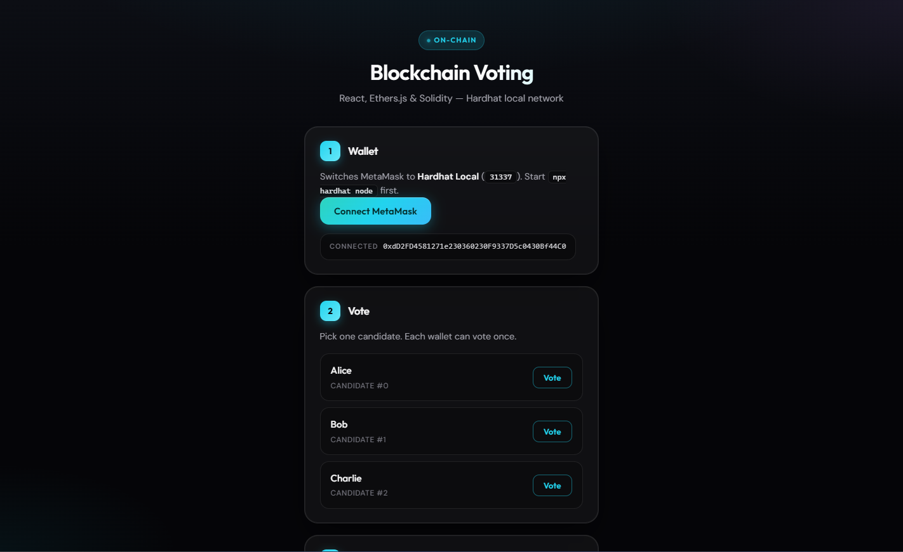
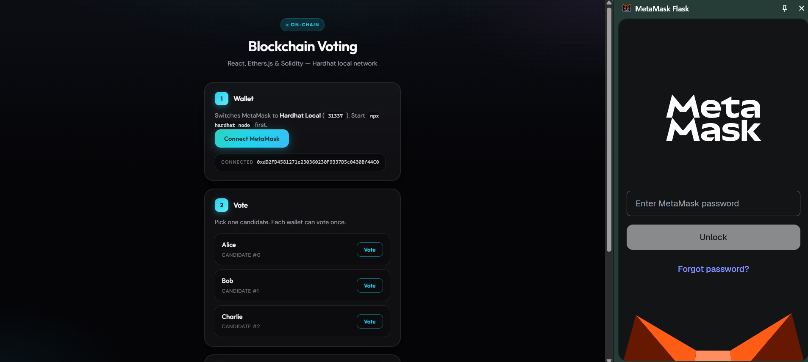
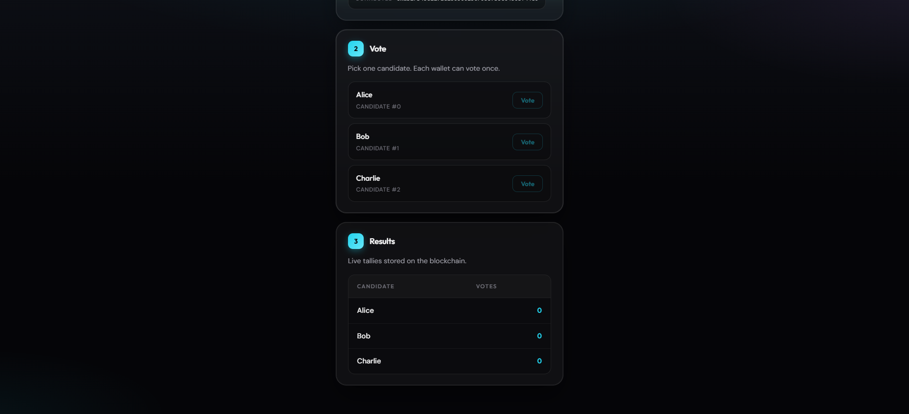

<<<<<<< HEAD
# 🗳️ Blockchain Voting DApp


A simple decentralized voting application built with Solidity, Hardhat, React, and Ethers.js. Users connect via MetaMask and vote securely on-chain with one vote per wallet.

---

## 🚀 Features

- ✅ Smart contract handles candidates and votes  
- 🔒 One vote per wallet (enforced on-chain)  
- ⚡ Real-time results from blockchain  
- 🦊 MetaMask integration  
- 🌐 No backend, fully decentralized  

---

## 🛠️ Tech Stack

- Solidity  
- Hardhat  
- React (Vite)  
- Ethers.js v6  
- MetaMask  

---

## 📸 Screenshots

### 🔹 App Interface
<p align="center">
  
</p>

### 🔹 Wallet Connection
<p align="center">
  
</p>

### 🔹 Voting Results
<p align="center">
  
</p>

---

## ⚙️ How to Run

### 1. Start Hardhat node
```bash
npx hardhat node
2. Deploy contract
npm run deploy

Copy contract address to:

frontend/.env

VITE_CONTRACT_ADDRESS=0x...
3. Run frontend
cd frontend
npm run dev
4. MetaMask Setup
RPC: http://127.0.0.1:8545
Chain ID: 31337
Import test account from Hardhat
📌 Notes
Restarting Hardhat = blockchain reset → redeploy required
Wrong contract address = app won’t work
Ignore minor Hardhat logs if voting works
📄 License

This project is for educational purposes only.
# 🗳️ Blockchain Voting DApp


A simple Blockchain Voting DApp built with Solidity, Hardhat, React, and Ethers.js. Users connect via MetaMask to vote securely on-chain, with one vote per wallet enforced by smart contract. Runs on a local Hardhat network with no backend or database required.

---

## 🚀 Features

- ✅ Smart contract handles candidates and votes  
- 🔒 One vote per wallet (enforced on-chain)  
- ⚡ Real-time results from blockchain  
- 🦊 MetaMask integration  
- 🌐 No backend, fully decentralized  

---

## 🛠️ Tech Stack

- Solidity  
- Hardhat  
- React (Vite)  
- Ethers.js v6  
- MetaMask  

---

## 📸 Screenshots

### 🔹 App Interface
<p align="center">
  
</p>

### 🔹 Wallet Connection
<p align="center">
  
</p>

### 🔹 Voting Results
<p align="center">
  
</p>

---

## ⚙️ How to Run

### 1. Start Hardhat node
```bash
npx hardhat node
2. Deploy contract
npm run deploy

Copy contract address to:

frontend/.env

VITE_CONTRACT_ADDRESS=0x...
3. Run frontend
cd frontend
npm run dev
4. MetaMask Setup
RPC: http://127.0.0.1:8545
Chain ID: 31337
Import test account from Hardhat
📌 Notes
Restarting Hardhat = blockchain reset → redeploy required
Wrong contract address = app won’t work
Ignore minor Hardhat logs if voting works
📄 License

This project is for educational purposes only.
